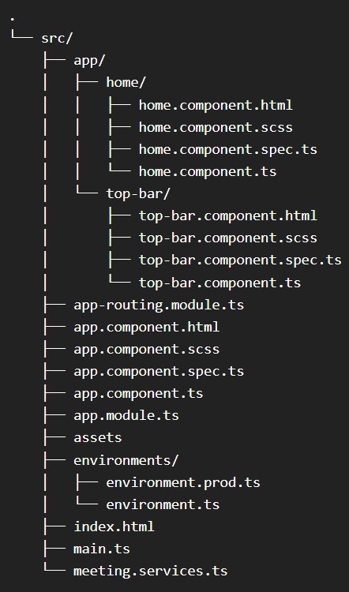

# Video RTC demo Using Ionic + Capacitor Demo (For Web)

[](https://)
[](https://discord.gg/kgAvyxtTxv)
[](https://app.videosdk.live/signup)

At Video SDK, we’re building tools to help companies create world-class collaborative products with capabilities of live audio/videos, compose cloud recordings/rtmp/hls and interaction APIs

## Setup Guide

- Sign up on [VideoSDK](https://app.videosdk.live/) and visit [API Keys](https://app.videosdk.live/api-keys) section to get your API key and Secret key.

- Get familiarized with [API key and Secret key](https://docs.videosdk.live/flutter/guide/video-and-audio-calling-api-sdk/signup-and-create-api)

- Get familiarized with [Token](https://docs.videosdk.live/flutter/guide/video-and-audio-calling-api-sdk/server-setup)


### Prerequisites

- Valid [Video SDK Account](https://app.videosdk.live/signup)

## Run the Sample App
### 0. File Structure of the project 

### 1. Clone the sample project

Clone the repository to your local environment.

```js
git clone  https://github.com/videosdk-live/quickstart.git
cd quickstart/ionic-rtc/demo2
```

### 2. Install the dependecies

Install all the dependecies to run the project.

```js
npm install
```

### 3. Update the enviroment.ts file

- Create a new file enviroment.ts inside `src/enviroments` and Copy the enviroment.example.ts file's data to enviroment.ts file

- Update the TOKEN in `enviroment.ts` file.Token would be generated from dashboard `https://app.videosdk.live/dashboard`

  ```js
  token: YOUR_TOKEN,
  ```

### 4. Run the sample app

- Bingo, It's time to run app

  ```js
  Ionic serve
  ```
## Ionic For Android
Running 'npm install -g @ionic/cli' installs the Ionic CLI globally on your system using Node Package Manager.
 ```js
  npm install -g @ionic/cli  # Installs both Ionic CLI and Capacitor
  ```
If the Ionic CLI and Capacitor are already installed, you'll need to update them if any errors occur.
  
   ```js
  npm update -g @ionic/cli 
  ```
  
In summary, 'ionic capacitor link' android is a command used to establish the necessary connections and configurations between your Ionic project and the Android platform
   ```js
  ionic capacitor link android 
  ```
  
  The purpose of running 'ionic cap sync' is to synchronize the web assets of your Ionic project with the native project created by Capacitor.
  ```js
 ionic cap sync 
  ```
 'Ionic capacitor run android' command is used to build and deploy your Ionic project to an Android device or emulator using Capacitor. However
'--verbose' flag allows you to get more detailed information during the build and deployment process.
```js
 ionic capacitor run android --verbose
  ```
  Running 'ionic build --prod' initiates the production build process for your Ionic application.
  The '--prod' flag triggers various optimizations to reduce the size of your application's files and improve its performance. This typically includes minification of JavaScript, CSS, and HTML files, as well as tree shaking to remove any unused code. 
  ```js
 ionic build --prod
  ```

## Key Concepts

- `Meeting` - A Meeting represents Real time audio and video communication.

  **`Note : Don't confuse with Room and Meeting keyword, both are same thing 😃`**

- `Sessions` - A particular duration you spend in a given meeting is a referred as session, you can have multiple session of a particular meetingId.
- `Participant` - Participant represents someone who is attending the meeting's session, `local partcipant` represents self (You), for this self, other participants are `remote participants`.
- `Stream` - Stream means video or audio media content that is either published by `local participant` or `remote participants`.

## Token Generation

Token is used to create and validate a meeting using API and also initialise a meeting.

🛠️ `Development Environment`:

- For development, you can use temporary token. Visit VideoSDK [dashboard](https://app.videosdk.live/api-keys) to generate temporary token.

🌐 `Production Environment`:

- For production, you have to set up an authentication server to authorize users. Follow our official example repositories to setup authentication server, [videosdk-rtc-api-server-examples](https://github.com/videosdk-live/videosdk-rtc-api-server-examples)


## API: Create and Validate meeting

- `create meeting` - Please refer this [documentation](https://docs.videosdk.live/api-reference/realtime-communication/create-room) to create meeting.
- `validate meeting`- Please refer this [documentation](https://docs.videosdk.live/api-reference/realtime-communication/validate-room) to validate the meetingId.


## [Initialize a Meeting](https://docs.videosdk.live/javascript/api/sdk-reference/initMeeting#initmeeting)

```js
const meeting = VideoSDK.initMeeting({
  meetingId: "abc-1234-xyz",
  name: "John Doe",
  micEnabled: true,
  webcamEnabled: true,
  maxResolution: "hd",
});
```


## [Mute/Unmute Local Audio](https://docs.videosdk.live/javascript/guide/video-and-audio-calling-api-sdk/handling-media/mute-unmute-mic)

```js
// unmute mic
meeting.unmuteMic();

// mute mic
meeting.muteMic();
```


## [Enable/Disable Local Webcam](https://docs.videosdk.live/javascript/guide/video-and-audio-calling-api-sdk/handling-media/on-off-camera)

```js
// enable webcam
meeting.enableCam();

// disable webcam
meeting.disableCam();
```


## [Leave or End Meeting](https://docs.videosdk.live/javascript/guide/video-and-audio-calling-api-sdk/setup-call/leave-end-meeting)

```js
// Only one participant will leave/exit the meeting; the rest of the participants will remain.
meeting.leave();

// The meeting will come to an end for each and every participant. So, use this function in accordance with your requirements.
meeting.end();
```


## [Listen for Meeting Events](https://docs.videosdk.live/javascript/guide/video-and-audio-calling-api-sdk/get-notified/meeting-events)

By registering callback handlers, VideoSDK sends callbacks to the client app whenever there is a change or update in the meeting after a user joins.

```js
meeting.on("meeting-joined", () => {
  // This event will be emitted when a localParticipant(you) successfully joined the meeting.
});

meeting.on("meeting-left", () => {
  // This event will be emitted when a localParticipant(you) left the meeting.
  // [errorMsg]: It will have the message if meeting was left due to some error like Network problem
});

meeting.on("participant-joined", (participant) => {
  // This event will be emitted when a new participant joined the meeting.
  // [participant]: new participant who joined the meeting
});

meeting.on("participant-left", (participant) => {
  // This event will be emitted when a joined participant left the meeting.
  // [participantId]: id of participant who left the meeting
});
```


## [Listen for Participant Media Events](https://docs.videosdk.live/javascript/guide/video-and-audio-calling-api-sdk/get-notified/media-events)

By registering callback handlers, VideoSDK sends callbacks to the client app whenever a participant's video, audio, or screen share stream is enabled or disabled.

```js
participant.on("stream-enabled", (stream) => {
  // This event will be triggered whenever a participant's video, audio or screen share stream is enabled.
});

participant.on("stream-disabled", (stream) => {
  // This event will be triggered whenever a participant's video, audio or screen share stream is disabled.
});
```

If you want to learn more about the SDK, read the Complete Documentation of [Javascript VideoSDK](https://docs.videosdk.live/javascript/guide/video-and-audio-calling-api-sdk/concept-and-architecture)


## Examples

- [Prebuilt SDK Examples](https://github.com/videosdk-live/videosdk-rtc-prebuilt-examples)
- [JavaScript SDK Example](https://github.com/videosdk-live/videosdk-rtc-javascript-sdk-example)
- [React JS SDK Example](https://github.com/videosdk-live/videosdk-rtc-react-sdk-example)
- [React Native SDK Example](https://github.com/videosdk-live/videosdk-rtc-react-native-sdk-example)
- [Flutter SDK Example](https://github.com/videosdk-live/videosdk-rtc-flutter-sdk-example)
- [Android SDK Example](https://github.com/videosdk-live/videosdk-rtc-android-java-sdk-example)
- [iOS SDK Example](https://github.com/videosdk-live/videosdk-rtc-ios-sdk-example)

## Documentation

[Read the documentation](https://docs.videosdk.live/) to start using VideoSDK.

## Community

- [Discord](https://discord.gg/Gpmj6eCq5u) - To get involved with the Video SDK community, ask questions and share tips.
- [Twitter](https://twitter.com/video_sdk) - To receive updates, announcements, blog posts, and general Video SDK tips.

## Examples

### Examples for Conference

- [videosdk-rtc-prebuilt-examples](https://github.com/videosdk-live/videosdk-rtc-prebuilt-examples)
- [videosdk-rtc-javascript-sdk-example](https://github.com/videosdk-live/videosdk-rtc-javascript-sdk-example)
- [videosdk-rtc-react-sdk-examplee](https://github.com/videosdk-live/videosdk-rtc-react-sdk-example)
- [videosdk-rtc-react-native-sdk-example](https://github.com/videosdk-live/videosdk-rtc-react-native-sdk-example)
- [videosdk-rtc-flutter-sdk-example](https://github.com/videosdk-live/videosdk-rtc-flutter-sdk-example)
- [videosdk-rtc-android-java-sdk-example](https://github.com/videosdk-live/videosdk-rtc-android-java-sdk-example)
- [videosdk-rtc-android-kotlin-sdk-example](https://github.com/videosdk-live/videosdk-rtc-android-kotlin-sdk-example)
- [videosdk-rtc-ios-sdk-example](https://github.com/videosdk-live/videosdk-rtc-ios-sdk-example)

### Examples for Live Streaming

- [videosdk-hls-react-sdk-example](https://github.com/videosdk-live/videosdk-hls-react-sdk-example)
- [videosdk-hls-react-native-sdk-example](https://github.com/videosdk-live/videosdk-hls-react-native-sdk-example)
- [videosdk-hls-flutter-sdk-example](https://github.com/videosdk-live/videosdk-hls-flutter-sdk-example)
- [videosdk-hls-android-java-example](https://github.com/videosdk-live/videosdk-hls-android-java-example)
- [videosdk-hls-android-kotlin-example](https://github.com/videosdk-live/videosdk-hls-android-kotlin-example)

## Documentation

[Read the documentation](https://docs.videosdk.live/) to start using Video SDK.

## Community

- [Discord](https://discord.gg/Gpmj6eCq5u) - To get involved with the Video SDK community, ask questions and share tips.

- [Twitter](https://twitter.com/video_sdk) - To receive updates, announcements, blog posts, and general Video SDK tips.

- [Twitter](https://twitter.com/video_sdk) - To receive updates, announcements, blog posts, and general Video SDK tips.

